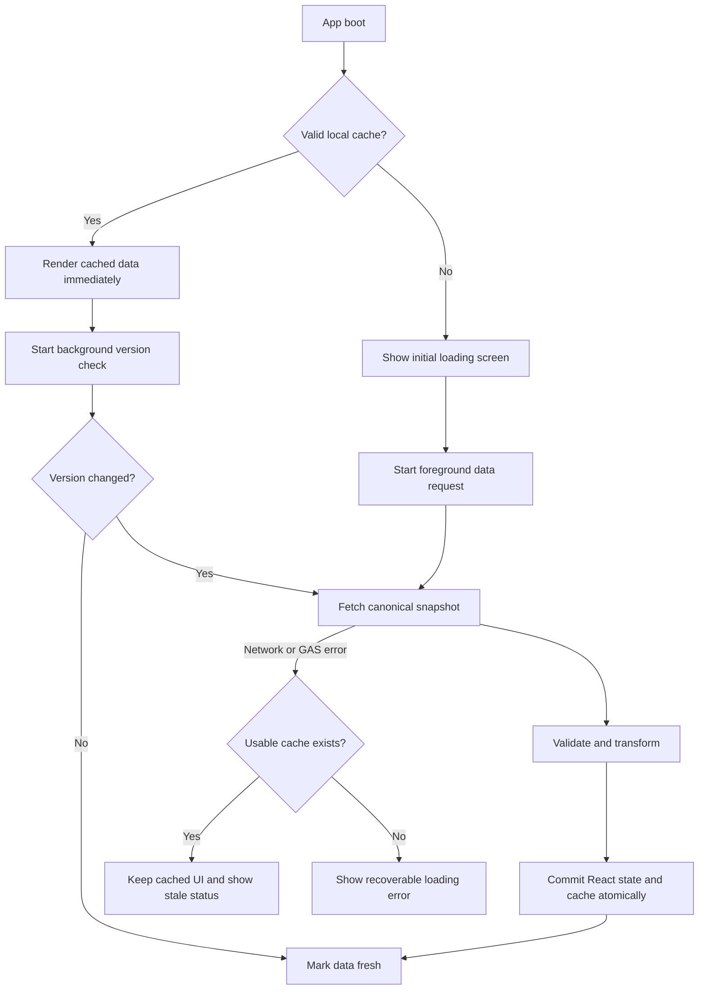

# Performance Optimization Specification

Status: Ready for implementation

Project: LOP TOAN NK

Scope: Frontend loading, browser cache, Google Apps Script read path, API payload,
mutation revalidation, and initial JavaScript delivery.

Last reviewed: 06/07/2026

## 1. Executive Summary

The current loading delay is not primarily caused by Vercel or recent UI work.
The main delay comes from a mismatch between frontend timeout policy and the
actual Google Apps Script response time.

Measured production baseline:

| Metric | Current value |
| --- | ---: |
| Vercel HTML response | about 418 ms |
| Main JavaScript response | about 922 ms |
| Main JavaScript size | 588,123 bytes raw, about 165 kB gzip |
| GAS `getData` response | 13.2-14.7 seconds |
| GAS response body | about 233 kB |
| Frontend initial timeout | 8 seconds |
| Retry delay after failure | 5 seconds |

The frontend aborts a normal GAS request before it can complete. It then waits
and retries, which can turn a 13-15 second backend response into a 26-35 second
blocking loading screen.

The target architecture is:

```text
Browser cache
  -> render usable app immediately
  -> refresh in background
  -> compare dataVersion
  -> download full data only when changed
  -> update cache atomically
```

The work must be delivered in small, reversible phases. Existing business
logic, Google Sheet headers, action names, and the current `getData` contract
must remain valid until the versioned replacement is proven in production.

## 2. Goals

### 2.1 User experience goals

- Returning users with valid cache can see and navigate the app within 2 seconds.
- A slow GAS response must not block read-only use when cache exists.
- First use without cache must not abort a response that is still within the
  normal observed GAS response range.
- The UI must communicate whether data is fresh, synchronizing, cached, or in
  an error state.
- No full-screen loading screen may reappear during normal background refresh.

### 2.2 Backend goals

- A read request must not format or migrate Google Sheets.
- A Sheet must be read at most once per GAS invocation unless a write occurs.
- Reopening an unchanged app must not transfer the full data snapshot.
- Existing write actions must remain backward compatible.
- Full data revalidation after a mutation must be reduced or deferred safely.

### 2.3 Payload goals

- Remove duplicate Vietnamese/English aliases from the new API contract.
- Keep phone numbers and identifiers as strings.
- Preserve `DD/MM/YYYY` for business dates.
- Keep attendance limited to `Co mat`, `Vang`, and `Co phep` at the frontend
  domain boundary.
- Target a canonical full payload below 120 kB raw with the current dataset.

## 3. Non-Goals

- Do not rename Google Sheets or existing headers.
- Do not change tuition, debt, attendance, teacher, or enrollment business rules.
- Do not remove the current `getData` endpoint during this project.
- Do not refactor all of `useAppData.ts` or `useDomains.ts` in one change.
- Do not introduce a new state management or query library.
- Do not add a database or move data away from Google Sheets.
- Do not make lazy loading a prerequisite for the cache-first fix.

## 4. Current System Findings

### 4.1 Cache is loaded but does not unlock the app

`useAppData` reads `ltn-cache` and initializes domain state from it. However:

```ts
const [loading, setLoading] = useState(true);
const dataReadyRef = useRef(false);
```

The application therefore renders the full-screen loading component even when
usable data already exists in memory.

### 4.2 Timeout is shorter than normal backend latency

Current policy:

```ts
initialFetchTimeout: 8_000,
initialLoadAutoRetryDelay: 5_000,
```

Observed `getData` latency is consistently above 13 seconds. The first request
is aborted, and the retry starts around second 13.

### 4.3 `getData` performs setup work

`getData()` currently calls:

```js
setupSheetsIfMissingOnly();
```

That function also calls `applyTextFormats()`. Formatting full columns is a
write-like maintenance operation and must not run on the hot read path.

### 4.4 GAS performs duplicate reads

The main adapter loads students and lessons. `readLeaveRequestsAdapter()` then
loads students and lessons again.

`getRows()` also performs:

```js
range.getValues();
range.getDisplayValues();
```

This may be necessary for phone preservation in the current schema, but the
result must be cached for the duration of the request.

### 4.5 Response aliases dominate payload size

Measured top-level payload:

| Domain | Records | JSON bytes |
| --- | ---: | ---: |
| Students | 78 | 153,284 |
| Teaching logs | 32 | 67,968 |
| Classes | 10 | 4,407 |
| Payments | 13 | 5,453 |
| Teachers | 2 | 1,282 |
| Expenses | 1 | 265 |

Students and teaching logs account for about 95% of the response. Each record
contains multiple aliases for the same value so that old frontend code can read
both Sheet names and domain names.

### 4.6 Mutations trigger full revalidation

Most successful handlers perform an optimistic state update and then call:

```ts
setSilent();
loadData();
```

This launches another full snapshot request after adding or editing a single
record. It is not blocking, but it adds GAS load and repeats a 233 kB transfer.

### 4.7 All screens are imported eagerly

`App.tsx` statically imports Overview, Operations, Learning, Finance, Reports,
Settings, and all modal modules. This increases initial JavaScript evaluation,
but it is a secondary issue compared with the GAS path.

## 5. Target Architecture



The implementation has four independent layers:

1. Cache-first frontend state machine.
2. Low-risk GAS read-path cleanup.
3. Versioned canonical API and mutation protocol.
4. Frontend code splitting.

## 6. Frontend State Model

Reuse the existing `DataSyncState` values:

```ts
type DataSyncState = 'idle' | 'syncing' | 'fresh' | 'cache' | 'error';
```

Required meanings:

| State | Usable data | Network request | UI behavior |
| --- | --- | --- | --- |
| `idle` | No | No | Transitional only |
| `syncing` | Maybe | Yes | Keep app visible if cache exists |
| `fresh` | Yes | No | Normal state |
| `cache` | Yes | No | Show non-blocking stale indicator |
| `error` | No | No | Show recoverable initial error |

The full-screen loading screen is controlled by data availability, not by
request activity:

```ts
const initialCacheRef = useRef<CachePayload | null>(readCacheSnapshot());
const hasInitialData = hasCacheData(initialCacheRef.current);

const [loading, setLoading] = useState(!hasInitialData);
const [syncState, setSyncState] = useState<DataSyncState>(
  hasInitialData ? 'cache' : 'syncing'
);

const dataReadyRef = useRef(hasInitialData);
```

Required invariant:

```text
loading === true only when no usable domain data is available.
```

`syncState === 'syncing'` must never imply that the app shell is hidden.

## 7. Frontend Loading Contract

Replace ambiguous `silent` behavior with an explicit mode internally:

```ts
type LoadMode = 'foreground' | 'background';

type LoadDataOptions = {
  mode?: LoadMode;
  timeout?: number;
  reason?: 'boot' | 'manual' | 'mutation' | 'visibility' | 'interval';
};
```

Backward-compatible callers may be adapted at the `useAppData` boundary. Do
not migrate every caller in the first patch.

### 7.1 Boot with cache

```ts
loadData({
  mode: 'background',
  timeout: RULES.network.fetchTimeout,
  reason: 'boot',
});
```

Expected behavior:

- Render cache immediately.
- Set `syncState` to `syncing`.
- Do not set full-screen `loading`.
- On success, replace data and mark `fresh`.
- On failure, keep cache and mark `cache`.

### 7.2 Boot without cache

```ts
loadData({
  mode: 'foreground',
  timeout: RULES.network.initialFetchTimeout,
  reason: 'boot',
});
```

Recommended initial values:

```ts
initialFetchTimeout: 25_000,
fetchTimeout: 30_000,
initialLoadRetryAfter: 8_000,
```

The timeout must be comfortably above the measured 13-15 second response.

### 7.3 Retry policy

Do not retry every five seconds indefinitely.

Use bounded exponential backoff:

```text
Attempt 1: immediate
Attempt 2: after 5 seconds
Attempt 3: after 15 seconds
Attempt 4: after 30 seconds
Stop automatic retries after attempt 4
```

Retry only when:

- `navigator.onLine` is true.
- The document is visible.
- No load is already active.
- No save is active.

Expose a manual retry button after automatic retries are exhausted.

### 7.4 Single-flight rule

Only one full snapshot request may run at a time.

Recommended refs:

```ts
const activeLoadRef = useRef<Promise<void> | null>(null);
const queuedRevalidateRef = useRef(false);
```

If a revalidation request arrives while one is active:

- Do not start another request.
- Set `queuedRevalidateRef.current = true`.
- Run at most one follow-up request after the active request finishes.

This prevents visibility events and mutations from creating request storms.

## 8. Cache Specification

Keep the existing `ltn-cache` key during P0 and P1.

Recommended payload:

```ts
type CachePayloadV2 = {
  schemaVersion: 2;
  dataVersion: string;
  cachedAt: string;
  data: {
    students: Student[];
    classes: ClassRecord[];
    payments: Payment[];
    expenses: Expense[];
    teachingLogs: TeachingLog[];
    teachers: Teacher[];
    leaveRequests: LeaveRequest[];
  };
};
```

### 8.1 Cache validation

A cache is usable when:

- JSON parsing succeeds.
- `schemaVersion` is supported.
- At least one core domain array is present.
- Required arrays are actually arrays.
- Required identifiers are strings.

An old cache must be migrated or ignored. It must never crash app boot.

### 8.2 Atomic cache commit

Build and stringify the entire payload before changing React state:

```ts
const nextCache = buildCachePayload(nextData, metadata);
const serialized = JSON.stringify(nextCache);

localStorage.setItem(CACHE_KEY, serialized);
applyData(nextData);
```

If `localStorage.setItem` fails, still apply valid network data to React state.
Report the cache failure separately; do not treat it as a GAS failure.

### 8.3 Cache freshness display

The app should expose:

- Last successful sync time.
- `Dang dong bo` while refreshing.
- `Dang dung du lieu luu luc HH:mm, DD/MM/YYYY` after a refresh error.

Do not show a toast on every background refresh. Use a stable status indicator
in the existing header/settings sync area.

## 9. Safe Mutation Policy

P0 must preserve current write behavior.

Long-term mutation requests should include:

```ts
type MutationEnvelope<T> = {
  action: string;
  requestId: string;
  baseVersion?: string;
  payload: T;
};
```

`requestId` is an idempotency key generated once for a user action. Retrying the
same save must reuse the same key.

Mutation response:

```ts
type MutationResult<T> = {
  ok: true;
  dataVersion: string;
  entity: T;
};
```

Required behavior:

- GAS validates and writes the mutation.
- GAS returns the canonical saved entity.
- Frontend replaces its optimistic entity with the returned entity.
- Frontend updates `dataVersion`.
- Do not immediately download a full snapshot for a successful isolated write.
- Queue one background revalidation after a short debounce when cross-domain
  joins may have changed.

Operations that require revalidation:

- Moving a student between classes.
- Editing a class teacher or schedule.
- Saving or editing a teaching log and attendance.
- Deleting entities referenced by another domain.

Operations that normally do not require immediate full revalidation:

- Editing student profile text.
- Adding or editing one payment when the server returns the canonical payment.
- Adding or editing one expense.
- Editing teacher profile text.

Server-side validation remains authoritative. Optimistic state must be rolled
back or replaced when a mutation fails.

## 10. GAS Read-Path Specification

### 10.1 Remove maintenance from reads

The following is forbidden inside `getData` and `getDataV2`:

```js
setupSheets();
setupSheetsIfMissingOnly();
applyTextFormats();
setNumberFormat();
autoResizeColumns();
```

`setupSheets()` and formatting remain explicit admin/migration operations.

`getSheet(name)` may still create one missing Sheet as a defensive fallback,
but normal production reads must not invoke setup across all Sheets.

### 10.2 Per-invocation context

Use a request-local cache:

```js
var REQUEST_CONTEXT = {
  spreadsheet: null,
  sheets: {},
  headers: {},
  rows: {}
};

function ss() {
  if (!REQUEST_CONTEXT.spreadsheet) {
    REQUEST_CONTEXT.spreadsheet = SpreadsheetApp.getActiveSpreadsheet();
  }
  return REQUEST_CONTEXT.spreadsheet;
}

function sh(name) {
  if (!Object.prototype.hasOwnProperty.call(REQUEST_CONTEXT.sheets, name)) {
    REQUEST_CONTEXT.sheets[name] = ss().getSheetByName(name);
  }
  return REQUEST_CONTEXT.sheets[name];
}
```

`getHeaders(sheetName)` and `getRows(sheetName)` must cache their results for
the current invocation.

After a write to a Sheet, invalidate only that Sheet:

```js
function invalidateSheetCache(sheetName) {
  delete REQUEST_CONTEXT.headers[sheetName];
  delete REQUEST_CONTEXT.rows[sheetName];
}
```

### 10.3 Eliminate duplicate adapter reads

Change:

```js
readLeaveRequestsAdapter()
```

to:

```js
readLeaveRequestsAdapter(leaveRows, studentsRaw, lessonsRaw)
```

The adapter must build maps from the arrays already loaded by the caller.

### 10.4 Instrument GAS stages

Add development-only timing around:

```text
open spreadsheet
read each Sheet
build maps
build students
build logs
serialize response
total request
```

Do not log student names, phone numbers, attendance notes, or financial details.

Example:

```js
function timed(label, fn, metrics) {
  var started = Date.now();
  var value = fn();
  metrics[label] = Date.now() - started;
  return value;
}
```

Timing metadata may be returned only when a private debug flag is enabled.

## 11. Versioned API Contract

Keep existing action:

```text
getData
```

Add:

```text
getDataV2
```

Request:

```json
{
  "action": "getDataV2",
  "sinceVersion": "optional-version"
}
```

Unchanged response:

```json
{
  "ok": true,
  "apiVersion": 2,
  "dataVersion": "20260706-42",
  "notModified": true,
  "serverTime": "2026-07-06T14:00:00.000Z"
}
```

Changed response:

```json
{
  "ok": true,
  "apiVersion": 2,
  "dataVersion": "20260706-43",
  "notModified": false,
  "serverTime": "2026-07-06T14:05:00.000Z",
  "data": {
    "students": [],
    "classes": [],
    "payments": [],
    "expenses": [],
    "teachingLogs": [],
    "teachers": [],
    "leaveRequests": []
  }
}
```

### 11.1 Canonical field policy

Each logical value appears once.

Examples:

```text
Student: id, name, classId, teacher, parentPhone
Class: id, name, teacherId, teacherName, branch, grade, sessions
Payment: id, studentId, classId, month, year, amount, method
TeachingLog: id, date, classId, shift, teacherId, attendance
Attendance: studentId, studentName, status, note
```

Do not return both:

```text
id and MaHS
name and HoTen and "Ho va ten hoc sinh"
classId and MaLop and "Ma Lop"
maGV and MaGV and teacherId
```

The V2 frontend adapter converts canonical transport objects into current
domain types. Existing components must not read transport DTOs directly.

### 11.2 Data version

Store a monotonically increasing version in `PropertiesService`.

Example:

```js
function getDataVersion() {
  return PropertiesService.getScriptProperties().getProperty('DATA_VERSION') || '0';
}

function bumpDataVersion() {
  var lock = LockService.getScriptLock();
  lock.waitLock(5000);
  try {
    var props = PropertiesService.getScriptProperties();
    var next = String(Number(props.getProperty('DATA_VERSION') || '0') + 1);
    props.setProperty('DATA_VERSION', next);
    return next;
  } finally {
    lock.releaseLock();
  }
}
```

Every successful business mutation must bump the version exactly once after
all related Sheet writes succeed.

Setup, formatting, and diagnostic logging must not bump the business version.

### 11.3 Server cache

Use `CacheService.getScriptCache()` only after V2 payload canonicalization.

Because the current snapshot is large, cache per domain or in bounded chunks:

```text
v2:{dataVersion}:core
v2:{dataVersion}:finance
v2:{dataVersion}:operations
```

The data version is part of the key, so old cache entries become unreachable
after a mutation. A short TTL of 30-60 seconds is sufficient to absorb repeated
opens without making version semantics complex.

Do not cache mutation responses.

## 12. Domain Loading Strategy

Implement in two steps.

### Step A: compact full snapshot

Ship `getDataV2` as one compact snapshot first. This minimizes migration risk
and gives a clean comparison with `getData`.

### Step B: split only if metrics justify it

Optional endpoints:

```text
getCoreV2
getFinanceV2
getOperationsV2
getReportsV2
```

`getCoreV2` should contain only data needed for Overview and navigation.
Finance, historical operations, and reports can load when their screen is
opened.

Do not split endpoints before measuring the optimized compact snapshot. The
current record count is small; most delay may disappear after removing Sheet
maintenance and duplicate reads.

## 13. Frontend Bundle Strategy

After P0-P2 are stable, convert secondary screens to lazy imports:

```ts
const OperationsTab = lazy(() => import('./OperationsTab'));
const LearningTab = lazy(() => import('./LearningTab'));
const FinanceTab = lazy(() => import('./FinanceTab'));
const ReportsTab = lazy(() => import('./ReportsTab'));
const SettingsTab = lazy(() => import('./SettingsTab'));
```

Keep Overview and the app shell eager.

Reports/Recharts should be in a separate chunk. Heavy export or print
dependencies should load only when their action is used.

Suspense fallbacks must use stable dimensions and must not reintroduce the
full-screen boot loading experience during screen navigation.

## 14. Error Handling

### Cache exists, refresh fails

- Keep the app visible.
- Set state to `cache`.
- Show last sync time.
- Do not clear domain arrays.
- Do not repeatedly toast the same error.

### No cache, initial request fails

- Keep a recoverable loading/error screen.
- Show manual retry.
- Apply bounded automatic retry.
- Preserve the configured Script URL.

### Response validation fails

- Do not write invalid data to cache.
- Keep the previous valid cache.
- Report a contract error separately from a network timeout.

### Mutation fails

- Roll back or replace the optimistic entity.
- Keep the previous `dataVersion`.
- Do not start a full refresh loop.
- Present one actionable error message.

## 15. Observability

Record these timings without personal data:

```text
app_boot_to_cache_render_ms
app_boot_to_network_fresh_ms
gas_request_ms
gas_parse_transform_ms
cache_parse_ms
cache_write_ms
initial_js_loaded_ms
```

Record counters:

```text
boot_source_cache
boot_source_network
network_timeout
network_retry
not_modified_response
full_snapshot_response
mutation_revalidation
```

Measurements may be kept in development console output initially. Do not add an
external analytics service as part of this task.

## 16. Acceptance Criteria

### P0: cache-first frontend

- With valid cache, the full-screen loading screen is not shown.
- Cached Overview is usable within 2 seconds on the normal test device.
- One background request starts.
- A background failure does not clear cached data.
- No more than one snapshot request runs concurrently.
- No business calculation changes.

### P1: GAS read cleanup

- `getData` does not call setup or formatting functions.
- Students and lessons are not read twice for leave requests.
- Existing `getData` response remains contract-compatible.
- Measured median GAS response is below 8 seconds with current production data.
- All existing save/update/delete actions still work.

### P2: API V2

- V1 and V2 work in parallel.
- `notModified` response works with matching `dataVersion`.
- Canonical payload contains no duplicate aliases.
- Current frontend domain types receive equivalent values.
- Payload is below 120 kB raw with the current dataset.
- Every successful mutation bumps `dataVersion` once.

### P3: bundle splitting

- Overview and navigation render without waiting for Reports/Recharts.
- Main initial chunk is materially smaller than the current 588 kB raw.
- No blank screen appears while a lazy screen loads.

## 17. Test Matrix

### Frontend

1. First visit with no cache and fast GAS.
2. First visit with no cache and 15-second GAS.
3. First visit with no cache and timeout.
4. Returning visit with valid cache and fast GAS.
5. Returning visit with valid cache and GAS timeout.
6. Corrupted `ltn-cache`.
7. Old cache schema.
8. Empty but valid datasets.
9. App hidden and shown during refresh.
10. Two mutations performed close together.
11. Mutation during background refresh.
12. Offline boot with cache.
13. Offline boot without cache.

### GAS

1. `getData` with all Sheets populated.
2. `getData` with empty optional Sheets.
3. `getDataV2` full snapshot.
4. `getDataV2` matching `sinceVersion`.
5. Student save and enrollment join.
6. Class teacher update.
7. Payment create/update/delete.
8. Expense create/update/delete.
9. Teaching log and attendance create/update.
10. Leave request adapter.
11. Concurrent mutation version increments.
12. Setup function still creates and formats missing Sheets.

### Regression

- Tuition and debt respect `startDate`, `endDate`, current month, `thangHP`,
  and `namHP`.
- Attendance remains `Co mat`, `Vang`, `Co phep`.
- Teacher resolution prefers `MaGV`.
- Phone numbers keep the leading zero.
- Existing action names and V1 response fields remain unchanged.

Required commands after each implementation phase:

```bash
npm.cmd run lint
npm.cmd run build
```

## 18. Rollout Plan

### Phase P0

Files:

```text
src/useAppData.ts
src/rules.ts
src/types.ts only if metadata types are required
```

Deploy frontend only. Observe cache boot and background refresh before changing
GAS.

Rollback: restore old loading initialization and timeout constants.

### Phase P1

Files:

```text
docs/gas/LOP_TOAN_NK_GAS_2026_2027_FULL.gs
docs/gas/GAS_IMPLEMENTATION_NOTES.md
```

Deploy a new GAS version while keeping the current frontend contract.

Rollback: redeploy the previous GAS Web App version.

### Phase P2

Files:

```text
docs/gas/LOP_TOAN_NK_GAS_2026_2027_FULL.gs
src/useAppData.ts
src/types.ts
new focused transport adapter module if needed
```

Use a feature flag:

```ts
const USE_DATA_API_V2 = false;
```

Enable V2 only after V1/V2 fixture comparison passes.

Rollback: set the flag to false. Do not remove V1.

### Phase P3

Files:

```text
src/App.tsx
Vite configuration only if chunk naming needs adjustment
```

Rollback: restore static imports.

## 19. Code Quality Rules

- Keep P0, P1, P2, and P3 in separate commits or review units.
- Do not mix UI redesign with performance work.
- New transport DTOs must not use `any`.
- Keep Sheet adapter logic in GAS and transport adaptation in one frontend module.
- Use existing date helpers; do not parse business dates ad hoc.
- Preserve phone and identifier strings.
- Use `AbortController` through the existing `fetchWithTimeout` helper.
- Do not swallow contract errors in an empty catch block.
- Do not mutate cached arrays returned by GAS request-local caches.
- Use functional React state updates for optimistic mutations.
- Do not add a dependency for retry, caching, or query state.
- Add comments only around state-machine invariants and version protocol.

## 20. Recommended Implementation Order

1. Implement cache-first initialization and explicit foreground/background load.
2. Correct timeout and bounded retry behavior.
3. Add single-flight request coordination.
4. Measure the new user-visible boot time.
5. Remove setup and formatting from GAS reads.
6. Add per-invocation Sheet/header/row caches.
7. Remove duplicate leave adapter reads.
8. Measure GAS again.
9. Add `getDataV2` and frontend transport DTOs.
10. Add `dataVersion` and `notModified`.
11. Return canonical entities from mutations and reduce full revalidation.
12. Split frontend bundles only after the data path is stable.

This order gives the largest user-visible improvement first while keeping every
step independently testable and reversible.
